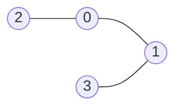
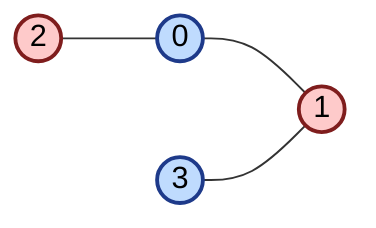

# graph-coloring

Códigos do projeto final da disciplina de Algoritmos Experimentais do curso de BSI da UFRN/CERES.

## Representação do grafo

Para esse problema, será criado um grafo qualquer G(V, E). Uma representação computacional possível é de uma matriz de adjacências, como o exemplo abaixo:



```python
# Matriz 4x4 para um grafo de ordem 4
graph: list[list] = [
    # 0  1  2  3
    [0, 1, 1, 0], # 0
    [1, 0, 0, 1], # 1
    [1, 0, 0, 0], # 2
    [0, 1, 0, 0], # 3
]
```

Outra representação é por meio de uma lista de adjacências:

```python
# Lista para um grafo de ordem 4
graph: list[list] = [
    [1, 2], # 0
    [0, 3], # 1
    [0], # 2
    [1], # 3
]
```

O número cromático desse grafo é 2. Então ele pode ser colorido da seguinte forma:



Para esse projeto, será utilizada a abordagem de lista de adjacência, alinhada com a criação de classes e objetos para facilitar a manipulação e representação do grafo, em especial na coloração.

## To-do

- [ ] Definir representação do grafo
- [ ] Criar algoritmo para gerar um grafo G(V, E) qualquer de ordem L
- [ ] Criar algoritmo genético (AG) para colorir esse grafo G com um número K
- [ ] Criar algoritmo de colônia artificial de abelhas (ABC) para colorir esse grafo G com um número K
- [ ] Gerar gráficos e comparar esses dois algoritmos
